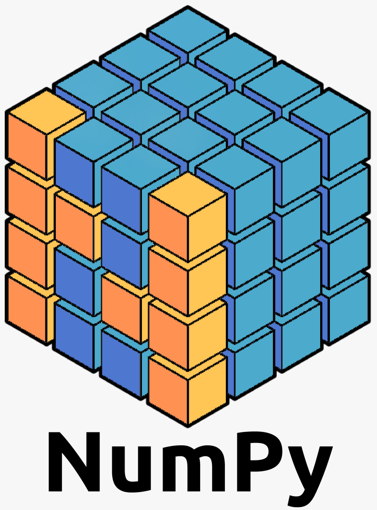
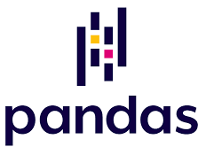
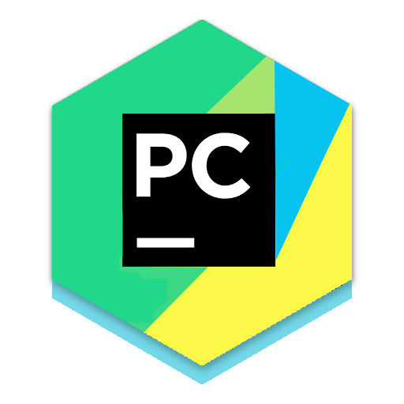
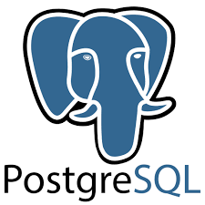
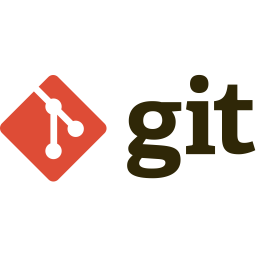

</a></a>
<!--</a></a>!-->
# Hi I am SaiNave 
I am a data enthusiast experience in  data analytics, soft robotics, algorithm development, programming, and IT support. 
My previous work experiences always gave me a chance to deal with the data  whether it is to generate, analyze or to visualize. 
Because of this, I had the opportunity to develop algorithms and deal with big data sets. 
I earned Master's in Robotic Control System Engineering which equipped me with strong understanding of Statistical analysis, mathematical modelling, machine learning and strong attention to detail. 
Being an engineer, I am always interested in new emerging technologies. I try to keep up with the everyday changing businesses and technologies to stay at the top of the game.

## My current Focus
- Improving advance python programming and SQL skills
- Working on personal projects based on python programming, database management, data analysis and visualization.
- Open for new job opportunities

✨ Fun fact: I am multilingual- fluent in English, Urdu, Korean (intermediate) and French (Beginner)
 ✨ Activities I do: badminton🏸, aerobics 🏃‍♀️, hiking 🥾, ice skating ⛸️ in winters and an avid traveller

## Reach me on

 

## 💻Languages & Tools

 

 

 
 
<!--

!-->

                                                                                                                                         

