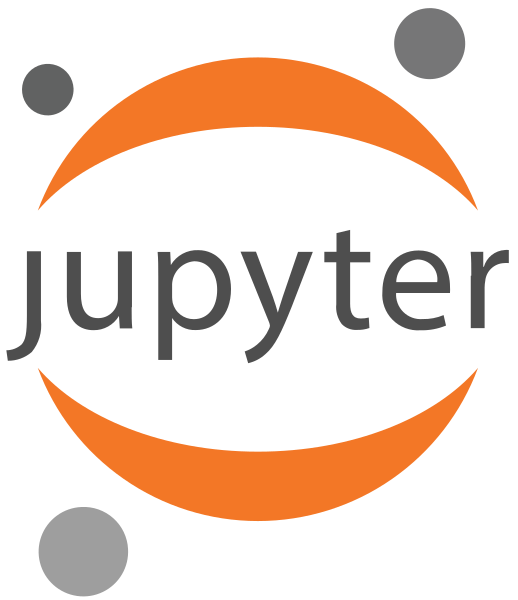

#  Hi I am Sairah Naveed 
I am a data-driven system analyst with a background in data analytics, soft robotics, algorithm development, programming, and IT support. Throughout my career, I’ve consistently worked with data—generating, analyzing, and visualizing it to uncover insights and drive decision-making. This experience has allowed me to take on diverse projects, from developing algorithms and managing systems to working with large datasets.

I hold a Master’s degree in Robotic Control System Engineering, which has provided me with a solid foundation in statistical analysis, mathematical modeling, and an exceptional attention to detail.

As an Electronics Engineer with a passion for emerging technologies, I stay current with rapid advancements in tech and business, striving to keep at the forefront of the industry.

✨ Fun fact: I am multilingual- fluent in English, Urdu, Korean (intermediate), and French (Beginner)
 ✨ Activities I do: badminton🸠aerobics ğŸƒâ€â™€ï¸ hiking 🥾 ice skating â›¸ï¸ and an avid traveller 

## My current Focus
- Health informatics and Project Management
- Working with Python libraries for data analysis and visualization, and SQL for data manipulation
- Working on personal projects involves database management, exploratory data analysis, dashboarding , and report development using BI tools .

## Reach me on

<!-- -->

 

## 💻Tools

 

<!----!>

 
 
 

<!----!>
</a>
</a>

</a>
</a>
<!----!>

 
 
<!--

!-->

                                                                                                                                         

